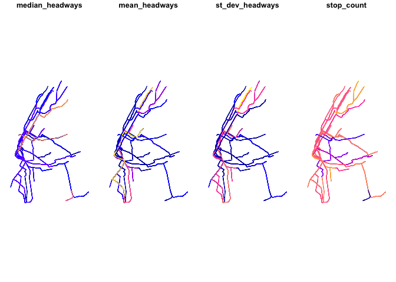

[](https://travis-ci.com/r-transit/tidytransit)
[](https://cran.r-project.org/package=tidytransit)

<!-- MarkdownTOC bracket="round" autolink="true" -->

- [Goal](#goal)
- [Installation](#installation)
- [Examples](#examples)
    - [Headways/Frequencies](#headwaysfrequencies)
        - [Route Headways](#route-headways)
        - [Stop Headways](#stop-headways)
    - [Map Data](#map-data)
        - [Map Route Frequencies](#map-route-frequencies)
- [GTFS Table Relationships](#gtfs-table-relationships)
- [Background](#background)

<!-- /MarkdownTOC -->

# Goal

Use this package to read, validate, analyze, and map data in the [General Transit Feed Specification](http://gtfs.org/) in R. 

# Installation

Install from CRAN:

``` r
install.packages("tidytransit")
```

# Examples

Load required packages:

``` r
library(tidytransit)
library(dplyr)
```

## Headways/Frequencies

Use NYC MTA subway schedule data to calculate headways by route, pulling directly from the MTA's URL.

``` r
NYC <- import_gtfs("http://web.mta.info/developers/data/nyct/subway/google_transit.zip")
```

### Route Headways

List the routes with the shortest median headways.

``` r
get_route_frequency_summary <- get_route_frequency(NYC) %>%
  arrange(median_headways)

fast_routes <- filter(get_route_frequency_summary, median_headways<25)

knitr::kable(head(fast_routes))
```

| route\_id | median\_headways | mean\_headways | st\_dev\_headways | stop\_count |
| :-------- | ---------------: | -------------: | ----------------: | ----------: |
| GS        |                4 |              4 |              0.01 |           4 |
| L         |                4 |              4 |              0.13 |          48 |
| 1         |                5 |              5 |              0.14 |          76 |
| 7         |                5 |              5 |              0.29 |          44 |
| 6         |                6 |              7 |              2.84 |          76 |
| E         |                6 |             23 |             53.01 |          48 |

### Stop Headways

List the stops with the shortest headways in the system.

``` r
stop_frequency_summary <- stop_frequency(NYC, by_route=FALSE) %>%
  inner_join(NYC$stops_df, by="stop_id") %>%
    select(stop_name, direction_id, stop_id, headway) %>%
      arrange(headway)
```

``` r
head(stop_frequency_summary)
```

    ## # A tibble: 6 x 4
    ## # Groups:   direction_id, stop_id [6]
    ##   direction_id stop_id stop_name             headway
    ##          <int> <chr>   <chr>                   <dbl>
    ## 1            0 902N    Times Sq - 42 St         3.60
    ## 2            1 901S    Grand Central - 42 St    3.60
    ## 3            1 902S    Times Sq - 42 St         3.60
    ## 4            0 901N    Grand Central - 42 St    3.61
    ## 5            0 702N    Mets - Willets Point     3.72
    ## 6            0 707N    Junction Blvd            3.72

## Map Data

Now lets turn the routes and stops tables in [`simple features`](https://github.com/r-spatial/sf) data frames:

``` r
NYC <- gtfs_as_sf(NYC)
```

This adds routes and stops tables with simple features/geometries to the list of NYC GTFS data. 

### Map Route Frequencies

Now we can join these frequencies to route geometries and plot them with
base R.

``` r
routes_headways_sf <- right_join(NYC$sf_routes,fast_routes, by="route_id")
routes_headways_sf_vars_only <- select(routes_headways_sf,-route_id)

plot(routes_headways_sf_vars_only)
```

<!-- -->

# GTFS Table Relationships

[Danny Whalen](https://github.com/invisiblefunnel) made a nice graph of
the relationships among gtfs tables in the
[partidge](https://github.com/remix/partridge) package for Python,
copied below. This can be a very helpful guide as you try to get a grasp
on the kinds of questions you might want to ask of transit schedule
data.


# Background

In function, this package and the tools it imports take their inspiration, and some code, from the [ROpenSci gtfsr](https://github.com/ropensci/gtfsr) package.
