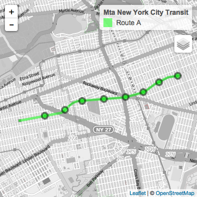

-   [Description](#description)
-   [Installation](#installation)
-   [Example Usage](#example-usage)

<!-- README.md is generated from README.Rmd. Please edit that file -->
[](https://travis-ci.org/ropenscilabs/gtfsr)

Description
-----------

`gtfsr` is an R package for easily importing, validating, and mapping transit data that follows the [General Transit Feed Specification (GTFS)](https://developers.google.com/transit/gtfs/) format.

The `gtfsr` package provides functions for converting files following the GTFS format into a single `gtfs` data objects. A `gtfs` object can then be validated for proper data formatting (i.e. if the source data is properly structured and formatted as a GTFS feed) or have any spatial data for stops and routes mapped using `leaflet`. The `gtfsr` package also provides API wrappers for the popular public GTFS feed sharing site [TransitFeeds](https://transitfeeds.com/), allowing users quick, easy access to hundreds of GTFS feeds from within R.

Installation
------------

You can install this package from GitHub using the devtools package:

    if (!require(devtools)) {
        install.packages('devtools')
    }
    devtools::install_github('ropenscilabs/gtfsr')

If you'd like to build the accompanying vignette, then run

    devtools::install_github('ropenscilabs/gtfsr', build_vignettes = TRUE)

If you have already installed `gtfsr`, you can get the latest version by running

    remove.packages('gtfsr')
    devtools::install_github('ropenscilabs/gtfsr')

Example Usage
-------------

``` r
library(gtfsr)
library(magrittr)
library(dplyr)

# set the API key
set_api_key('XXXXXXXX-XXXX-XXXX-XXXX-XXXXXXXXXX')

# get the feedlist dataframe and filter out NYC subway
feedlist_df <- get_feedlist() %>%
  filter(grepl('NYC Subway GTFS',t, ignore.case= TRUE))

# import NYC gtfs feed by sending the url to `import_gtfs`
NYC <- import_gtfs(feedlist_df$url_d)
#> Unzipped the following files to directory '/private/var/folders/97/sbpwvr3n36516bwd2yjrmsc80000gn/T/RtmpLJNK2r/filef2f456e95ba1'...
#> [1] "agency.txt"         "calendar_dates.txt" "calendar.txt"      
#> [4] "routes.txt"         "shapes.txt"         "stop_times.txt"    
#> [7] "stops.txt"          "transfers.txt"      "trips.txt"
#> Reading agency.txt
#> Reading calendar_dates.txt
#> Reading calendar.txt
#> Reading routes.txt
#> Reading shapes.txt
#> Reading stop_times.txt
#> Reading stops.txt
#> Reading transfers.txt
#> Reading trips.txt
#> ...done.
#> Testing data structure...
#> ...passed. Valid GTFS object.
#> 
#> NOTE: Parsing errors and warnings while importing data can be extracted from any given dataframe with `attr(df, "problems")`.
#> 

# get line (routes) A and B
routes <- NYC[['routes_df']] %>%
  slice(which(grepl('a|b', route_id, ignore.case=TRUE))) %>%
  '$'('route_id')

# take the NYC `gtfs` object and map routes. includes stops by default.
NYC %>% map_gtfs(route_ids = routes)
```


``` r

# gtfs will plot ALL shapes for a given route_ids. These can be reduced using the `service_ids` option.
ids <- NYC$trips_df %>%
  select(route_id, service_id, shape_id) %>%
  distinct() %>%
  filter(route_id %in% routes)
ids %>% head(5) # see all unique combos of ids
#> # A tibble: 5 × 3
#>   route_id   service_id shape_id
#>      <chr>        <chr>    <chr>
#> 1        A B20160612WKD  A..N43R
#> 2        A B20160612WKD  A..S43R
#> 3        A B20160612WKD  A..N85R
#> 4        A B20160612WKD  A..N54R
#> 5        A B20160612WKD  A..N65R

# lets map just the the first row
route_ids <- ids$route_id[1]
service_ids <- ids$service_id[1]
shape_ids <- ids$shape_id[1]

# lets map the specific data with some other options enabled.
NYC %>%
  map_gtfs(route_ids = route_ids,
    service_ids = service_ids,
    shape_ids = shape_ids,
    route_colors = 'green', # set the route color
    stop_details = TRUE, # get more stop details on click
    route_opacity = .5) # change the route opacity
```



[](http://ropensci.org)
