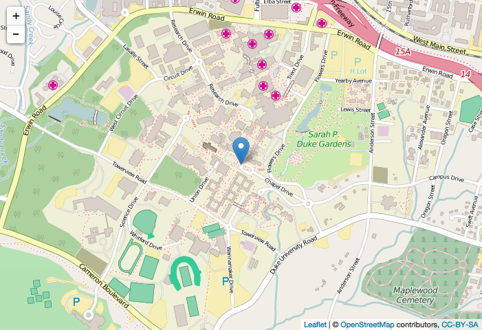
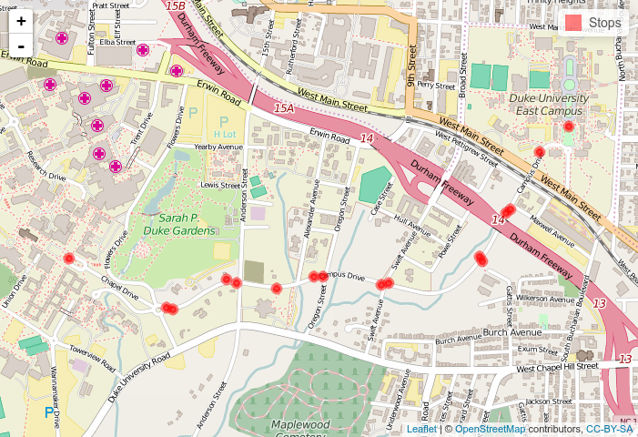
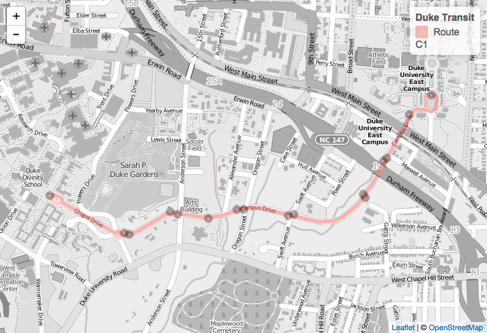
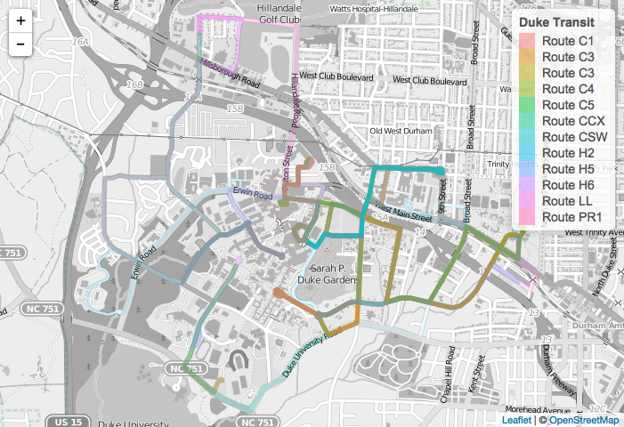
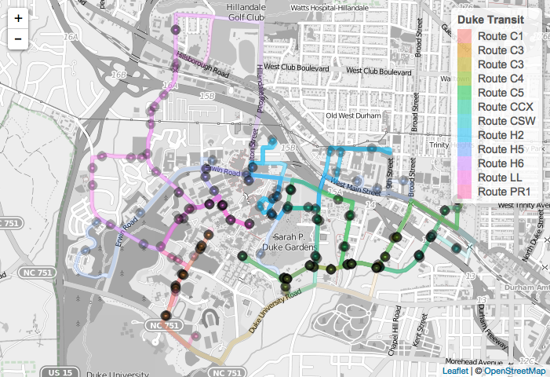

-   [Description](#description)
-   [Installation](#installation)
-   [Example Usage (`gtfsr` vignette)](#example-usage-gtfsr-vignette)
-   [1. Get an GTFS API key](#get-an-gtfs-api-key)
-   [2. Use `gtfsr` package to download feed list](#use-gtfsr-package-to-download-feed-list)
-   [3. Validating the file and fields structure of a GTFS feed](#validating-the-file-and-fields-structure-of-a-gtfs-feed)
-   [4. Mapping stops and routes using `gtfsr`](#mapping-stops-and-routes-using-gtfsr)

<!-- README.md is generated from README.Rmd. Please edit that file -->
[](https://travis-ci.org/ropenscilabs/gtfsr)

Description
-----------

`gtfsr` is an R package for easily importing, validating, and mapping transit data that follows the [General Transit Feed Specification (GTFS)](https://developers.google.com/transit/gtfs/) format.

The `gtfsr` package provides functions for converting files following the GTFS format into a single `gtfs` data objects. A `gtfs` object can then be validated for proper data formatting (i.e. if the source data is properly structured and formatted as a GTFS feed) or have any spatial data for stops and routes mapped using `leaflet`. The `gtfsr` package also provides API wrappers for the popular public GTFS feed sharing site [TransitFeeds](https://transitfeeds.com/), allowing users quick, easy access to hundreds of GTFS feeds from within R.

Installation
------------

You can install this package from GitHub using the devtools package:

    if (!require(devtools)) {
        install.packages('devtools')
    }
    devtools::install_github('ropenscilabs/gtfsr')

If you'd like to build the accompanying vignette, then run

    devtools::install_github('ropenscilabs/gtfsr', build_vignettes = TRUE)

If you have already installed `gtfsr`, you can get the latest version by running

    remove.packages('gtfsr')
    devtools::install_github('ropenscilabs/gtfsr')

Example Usage (`gtfsr` vignette)
--------------------------------

1. Get an GTFS API key
----------------------

This package can get data from a user-specified URL and is also able to get GTFS data from the [TransitFeeds API](http://transitfeeds.com/api/). This vignette will focus on the case where GTFS data is extracted from the TransitFeed API. Below are the steps needed to get a API key (note: requires a GitHub account), including a YouTube (click the GIF to see the YouTube video) that visually guides you through the steps.

1.  *Go to <http://transitfeeds.com/>*
2.  *Click* "Sign in with GitHub" *in the top-right corner.*
    -   If it is your first time visiting the site, it will ask you to sign in (and likely every time if you do not have cookies enabled).

3.  *Once signed in, click your profile icon in the top-right and select* "API Keys" *from the drop-down menu.*
    -   Your GitHub profile icon and username replaces "Sign in with GitHub".

4.  *Fill in* "Enter a description" *and then click the* "Create Key" *button*.
5.  *Copy your new API Key to your clipboard.*

[](https://youtu.be/ufM67FoIMho)

2. Use `gtfsr` package to download feed list
--------------------------------------------

First things first, load the `gtfsr` package and set your key to access the TransitFeeds API. This example also using the `dplyr` package to manage data frames and `magrittr` for piping.

``` r
library(gtfsr)
library(magrittr)
library(dplyr)
options(dplyr.width = Inf) # I like to see all the columns

set_api_key('2ec1ae29-b8c2-4a03-b96e-126d585233f9') # input your API key here
```

### Getting full list of available GTFS feeds

With a valid API key loaded, you can easily get the full list of GTFS feeds using the `get_feedlist` function. What we care most about are the feed GTFS data urls contained in column `url_d` of the feed list. Since we are interested in acquiring the GTFS data (not just the feedlist), we can use the `filter_feedlist()` function to return a data frame containing only valid feed urls.

*By default, `filter_feedlist()` only checks to make sure each links starts with `http[s]://`. To check the link is actually working, use option `test_url = TRUE`. But beware, this can take a while!*

``` r
feedlist_df <- get_feedlist() # create a data frame of all feeds

feedlist_df <- feedlist_df %>% filter_feedlist # filter the feedlist
#> 152 of 649 feeds did not provide valid URLs. 497 returned.

feedlist_df %>% select(url_d) %>% head(5) # show first 5 feed urls
#> Source: local data frame [5 x 1]
#> 
#>                                                                                  url_d
#>                                                                                  (chr)
#> 1       http://data.trilliumtransit.com/gtfs/thousandoaks-ca-us/thousandoaks-ca-us.zip
#> 2           http://corporate.sunrail.com/wp-content/uploads/2016/05/google_transit.zip
#> 3                 http://data.trilliumtransit.com/gtfs/westcat-ca-us/westcat-ca-us.zip
#> 4 http://data.trilliumtransit.com/gtfs/marthasvineyard-ma-us/marthasvineyard-ma-us.zip
#> 5 http://data.trilliumtransit.com/gtfs/eldoradotransit-ca-us/eldoradotransit-ca-us.zip
```

If we want only the data for a specific location (or locations), we can get then search the feedlist for feeds of interest.

Assume we are interested in getting all the GTFS data from *Australian* feeds (i.e. we search for location names for the word 'australia'). We can match Australian agencies by name (filter on `loc_t`) and extract the corresponding url feeds (select `url_d`).

### Subsetting the GTFS feedlist

``` r
## get australian feeds
aussie_df <- feedlist_df %>%
    filter(grepl('australia', loc_t, ignore.case = TRUE)) # filter out locations with "australia" in name

aussie_df %>% select(loc_t) %>% head(5) # look at location names
#> Source: local data frame [5 x 1]
#> 
#>                        loc_t
#>                        (chr)
#> 1   Melbourne VIC, Australia
#> 2 Burnie TAS 7320, Australia
#> 3  Launceston TAS, Australia
#> 4      Hobart TAS, Australia
#> 5      Cairns QLD, Australia

aussie_urls <- aussie_df %>% select(url_d) # get aussie urls
```

Once we have the urls for the feeds of interest, we can download and extract all the GTFS data into a list of `gtfs` objects using the `import_gtfs` function.

``` r
gtfs_objs <- aussie_urls %>% slice(8:9) %>% import_gtfs
```

### Inspecting Parsing Errors/Warnings

During the import of the any feed url, you will see the following message:

    NOTE: Parsing errors and warnings while importing data can be extracted from any given data frame with `attr(df, "problems")`.

This output was suppressed in the last section to save space given how verbose it is. But the highlighted `NOTE` explains that *if one observes an error or warning during the import process*, one can extract a data frame of problems, which is stored as an attribute for any data frame contained within any `gtfs` object that had a warning output.

As an example, let's extract the data and problems data frames for a url with parsing errors/warnings.

``` r
url <- 'http://www.co.fairbanks.ak.us/transportation/MACSDocuments/GTFS.zip'

gtfs_obj <- url %>% import_gtfs
```

If you look at the output when creating the `gtfs_obj` object, you should see output that looks like this...

    ...
    Reading calendar.txt
    Warning: 2 parsing failures.
    row col   expected    actual
      3  -- 10 columns 1 columns
      4  -- 10 columns 1 columns
    ...

To understand the problem, let's extract the data frame `calendar_df`. Recall that `import_gtfs` returns either a single `gtfs` object (if one url is provided) or a list of `gtfs` objects. Each `gtfs` object is just a list of data frames.

``` r
# extract `calendar_df` from gtfs_obj
df <- gtfs_obj$calendar_df

df
#> Source: local data frame [4 x 10]
#> 
#>   service_id monday tuesday wednesday thursday friday saturday sunday
#>        (chr)  (int)   (int)     (int)    (int)  (int)    (int)  (int)
#> 1    Weekday      1       1         1        1      1        0      0
#> 2   Saturday      0       0         0        0      0        1      0
#> 3         NA     NA      NA        NA       NA     NA       NA     NA
#> 4         NA     NA      NA        NA       NA     NA       NA     NA
#>   start_date end_date
#>        (chr)    (chr)
#> 1   20151215 20161231
#> 2   20151215 20161231
#> 3         NA       NA
#> 4         NA       NA

attr(df, 'problems')
#> Source: local data frame [2 x 4]
#> 
#>     row   col   expected    actual
#>   (int) (chr)      (chr)     (chr)
#> 1     3    NA 10 columns 1 columns
#> 2     4    NA 10 columns 1 columns
```

From inspecting the output from `attr(df, 'problems')` and comparing it to just `df`, it appears the problems (at least for this particular `calendar_df`) stem from the empty rows added to the end of the original text file. Not a big deal and easily fixed. But we leave such specific fixes to the user to correct.

3. Validating the file and fields structure of a GTFS feed
----------------------------------------------------------

GTFS feeds contain numerous *required* and *optional* files. And within each of these files, there are also *required* and *optional* fields (variables). (For more detailed information, please see Google's [GTFS Feed Specification Reference](https://developers.google.com/transit/gtfs/reference). Information on non-standard GTFS files---specifically `timetables-new.txt` and `timetable_stop_order-new.txt`---can be found at the [GTFS-to-HTML repo](https://github.com/brendannee/gtfs-to-html).

After one has successfully downloaded and unpacked a transit feed, there is no guarantee that it satisfies the requirements of a valid GTFS feed. For example, an unpacked directory may contain all the properly named text files (e.g. `agency.txt`, `stops.txt`, etc), but it could be that within each text file there is no data or that some of the required fields (or variables) (e.g. `stop_id`) are missing.

The `gtfsr` package can quickly check the file and field structure of a GTFS feed and inform you if all required files and fields have been found. Additional information about optional files and fields is also provided. The function is called `validate_gtfs_structure()`. It inputs an object of class `gtfs` (the output of functions `import_gtfs()` or `read_gtfs()`) and, by default, attaches a `validate` attribute (i.e. `attr(gtfs_obj, 'validate')`) to the `gtfs` object. This `validate` attribute is just a list of validation information. Set the option `return_gtfs_obj = FALSE` if you only want this validation list.

Let's take a look at an example, using transit feed data from agencies in Durham, NC, USA.

``` r
nc <- feedlist_df %>%
    filter(grepl('NC, USA', loc_t, ignore.case=TRUE)) # get NC agencies

durham_urls <- nc %>%
    filter(grepl('durham', loc_t, ignore.case=TRUE)) %>%
    select(url_d) # get durham urls

gtfs_objs <- durham_urls %>% import_gtfs(quiet=TRUE) # quietly import

sapply(gtfs_objs, class) # verify that each object of is a `gtfs` object
#> [1] "gtfs" "gtfs" "gtfs"

# validate file and field structures ----------
# attach `validate` data as attribute
gtfs_objs_w_validate <- lapply(gtfs_objs, validate_gtfs_structure)

# extract `validate` attribute data
validate_list_attr <- lapply(gtfs_objs_w_validate, attr, which = 'validate')

# extract validation data directly
validate_list_direct <- lapply(gtfs_objs, validate_gtfs_structure, return_gtfs_obj = FALSE)

# both methods work. option `return_gtfs_obj = FALSE` is more direct
identical(validate_list_attr, validate_list_direct)
#> [1] TRUE
```

The `validate` attribute (or list) will always contain 4 elements:

-   `all_req_files` a logical value which checks if all *required* files have been found
-   `all_req_fields_in_req_files` a logical value which checks if all *required* fields *within required files* have been found
-   `all_req_fields_in_opt_files` a logical value which checks if all *required* fields *within any **optional** files* have been found (i.e. `FALSE` if an optional file is provided but is missing a *required* field)
-   `validate_df` a data frame containing all files and fields found plus their status

There can also be 3 other elements:

-   `problem_req_files` a data frame which highlights problematic *required* files (required files that are either missing or have missing required fields)
-   `problem_opt_files` a data frame which highlights problematic *optional* files (optional files that are missing *required fields*)
-   `extra_files` a data frame of any extra files found (i.e. non-standard GTFS feed files not listed as optional or required)

Taking a closer look, we can see that all 3 Durham agencies provide all required files and they contain all required fields. However, all 3 Durham agencies provided *optional files* that are missing *required fields*.

``` r
validate_list_attr %>% sapply(. %>% extract2('all_req_files'))
#> [1] TRUE TRUE TRUE

validate_list_attr %>% sapply(. %>% extract2('all_req_fields_in_req_files'))
#> [1] TRUE TRUE TRUE

validate_list_attr %>% sapply(. %>% extract2('all_req_fields_in_opt_files'))
#> [1] FALSE FALSE FALSE

# OR, without piping
# sapply(validate_list_attr, '[[', 'all_req_files')
# sapply(validate_list_attr, '[[', 'all_req_fields_in_req_files')
# sapply(validate_list_attr, '[[', 'all_req_fields_in_opt_files')
```

We can get more detail about the problematic optional files by extracting the element `problem_opt_fields`.

``` r
# extract the `problem_opt_files` from the validation list
validate_list_attr[[3]]$problem_opt_files
#> Source: local data frame [8 x 6]
#> 
#>                   file file_spec file_provided_status         field
#>                  (chr)     (chr)                (chr)         (chr)
#> 1      fare_attributes       opt                  yes     transfers
#> 2          frequencies       opt                  yes       trip_id
#> 3          frequencies       opt                  yes    start_time
#> 4          frequencies       opt                  yes      end_time
#> 5          frequencies       opt                  yes  headway_secs
#> 6 timetable_stop_order       opt                  yes  timetable_id
#> 7 timetable_stop_order       opt                  yes       stop_id
#> 8 timetable_stop_order       opt                  yes stop_sequence
#>   field_spec field_provided_status
#>        (chr)                 (chr)
#> 1        req                 empty
#> 2        req                 empty
#> 3        req                 empty
#> 4        req                 empty
#> 5        req                 empty
#> 6        req                 empty
#> 7        req                 empty
#> 8        req                 empty
```

We can see that the optional `frequencies.txt` file was provided but all of the *required fields* were empty.

It is important to recall that most GTFS feed files and fields are **optional**. Therefore, while useful to know any potential problems with optional files provided by a given feed, we can still proceed with doing interesting analyses as long as we have all the required files and fields.

4. Mapping stops and routes using `gtfsr`
-----------------------------------------

**NOTE:** *Github does not allow javascript. As a result, we use static PNG pictures as placeholders for what are actually interactive `leaflet` maps. If you build the vignette or run the codes in R, these `leaflet` maps should be built automatically.*

The `gtfsr` has mapping functions designed to help users quickly map spatial data that is found within most GTFS feeds. These functions input `gtfs` objects and then map the desired datum or data (stop, route, route networks).

Let's try mapping a stop from a bus route popular with Duke University students---the *C1 East-West Loop*. This route bounces between Duke's East and West campus. The *C1* idles at one of the busiest stops at Duke---the "West Campus Chapel" stop. (This bus stop is located in front of Duke University's iconic gothic Chapel, Duke's most famous landmark.)

First, let's convert Duke University's GTFS transit feed into a `gtfs` object.

``` r
nc <- feedlist_df %>%
    filter(grepl('NC, USA', loc_t, ignore.case=TRUE)) # get NC agencies

duke_gtfs_obj <- nc %>%
    filter(grepl('duke', t, ignore.case=TRUE)) %>%  # note, we search `t` (agency name)
    select(url_d) %>%   # get duke univeristy feed url
    import_gtfs(quiet=TRUE)     # suppress import messages and prints
```

Next, we search for the the "West Campus Chapel" stop. We can search the required field `stop_name` for something that matches with a clever combination of `dplyr::slice` plus `which` and `grepl`.

``` r
# look for west chapel stop
west_chapel_stop_id <- duke_gtfs_obj[['stops_df']] %>%
    slice(which(grepl('west campus chapel', stop_name, ignore.case=TRUE))) %>%
    extract2('stop_id') # extract just the stop_id

west_chapel_stop_id
#> [1] "778070"
```

Now, we can quickly map the stop using the function `map_gtfs_stop()`.

``` r
map_gtfs_stop(gtfs_obj = duke_gtfs_obj, stop_id = west_chapel_stop_id)
```



Let's go further and map out all stops and the shape of the popular *C1 East-West Loop* bus route. We need only find the `route_id` before mapping all the stops using `map_gtfs_route_stops()` and the shape using `map_gtfs_route_shape()`.

``` r
C1_route_id <- duke_gtfs_obj[['routes_df']] %>%
    slice(which(grepl('C1', route_short_name, ignore.case=TRUE))) %>% # search for "C1"
    extract2('route_id') # extract just the datum in route_id

map_gtfs_route_stops(gtfs_obj = duke_gtfs_obj, route_id = C1_route_id) # map all stops along route
```



``` r
map_gtfs_route_shape(gtfs_obj = duke_gtfs_obj, route_id = C1_route_id) # map route shape with stops
```



Finally, we can get visualize all of the routes that make up Duke University's Transit system using `map_gtfs_agency_routes`. Duke University Transit system is made of only one agency (`duke_agency_name = "Duke Transit"`). If desired, we can also add every stop for every route in the network by using option `include_stops = TRUE` (this option is `FALSE` by default).

``` r
duke_agency_name <- duke_gtfs_obj[['agency_df']]$agency_name[1]

map_gtfs_agency_routes(gtfs_obj = duke_gtfs_obj, agency_name = duke_agency_name) # map all routes of agency
```



``` r
map_gtfs_agency_routes(gtfs_obj = duke_gtfs_obj, agency_name = duke_agency_name, include_stops = TRUE) # map all routes of agency with stops
```



[](http://ropensci.org)
