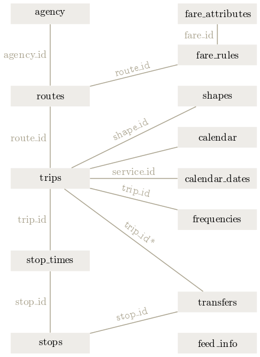

```{r setup, include=FALSE}
knitr::opts_chunk$set(echo = TRUE)
library(tidytransit)
library(dplyr)
```
[](https://travis-ci.com/r-transit/tidytransit)
<!-- [](https://cran.r-project.org/package=tidytransit) -->

# Introduction

Use tidytransit to:

- read GTFS zip files into R
- automatically cast the spatial and temporal data in the feeds into more usable R data types  
- create graphics about transit service
- map existing stops and routes
- estimate transit frequencies
- validate transit feeds

# Installation

This package requires a working installation of [sf](https://github.com/r-spatial/sf#installing). 

```{r, eval=FALSE}
# Once sf is installed, you can install from CRAN with: 
install.packages('tidytransit')

# For the development version from Github:
# install.packages("devtools")
devtools::install_github("r-transit/tidytransit")
```

For some users, `sf` is impractical to install due to system level dependencies. For these users, [`trread`](https://github.com/r-transit/trread) may work better. Its tidytransit without geospatial (GDAL) tools. 

# The General Transit Feed Specification

GTFS feeds contain many linked tables about published transit schedules about trips, stops, and routes. Below is a diagram of these relationships and tables. 


Source: Wikimedia, user -stk. 

Since GTFS is a data standard, you can find many uses for it which have not been considered here. The [summary page for the GTFS standard](https://developers.google.com/transit/gtfs/#overview-of-a-gtfs-feed) is a good resource.

GTFS works well with R given that the data structure is tabular.  

# Usage

## Read GTFS data

GTFS data come packaged as a zip file of tables in text form. The main thing tidytransit does is consolidate the reading of all those tables into a single R object, which contains a list of the tables in each feed. 

Below we use the tidytransit `read_gtfs` function in order to read a feed from the NYC MTA into R. 

We use a feed included in the package in the example below. But note that you can read directly from the New York City Metropolitan Transit Authority, as shown in the commented code below. 

You can also read from any other URL. This is useful because there are many sources for GTFS data, and often the best source is transit service providers themselves. See the next section on "Finding More GTFS Feeds" for more sources of feeds. 

```{r}
# nyc <- read_gtfs("http://web.mta.info/developers/data/nyct/subway/google_transit.zip")

local_gtfs_path <- system.file("extdata", 
                               "google_transit_nyc_subway.zip", 
                               package = "tidytransit")
nyc <- read_gtfs(local_gtfs_path, 
                 local=TRUE)
```

Each of the source tables for the GTFS feed is now available in the nyc `gtfs` object. 

For example, stops:

```{r}
head(nyc$stops)
```

The tables available on each feed may vary. Below we can simply print the names of all the tables that were read in for this feed. Each of these is a table. 

```{r}
names(nyc)
```

## Finding More GTFS Feeds

Included in the tidytransit package is a dataframe with a list of urls, city names, and locations. 

You can browse it as a data frame:

```{r}
head(feedlist)
```

Note that there is a url (`url_d`) for each feed, which can be used to read the feed for a given city into R. 

For example:

```{r, eval=FALSE}
nyc_ferries_gtfs <- feedlist %>% 
  filter(t=="NYC Ferry GTFS") %>%
  pull(url_d) %>%
  read_gtfs()
```

Included in the transitfeeds table is a set of coordinates for each feed. This means you can filter feed sources by location. Or map all of them, as below:

```{r}
library(sf)

feedlist_sf <- st_as_sf(feedlist,
                        coords=c("loc_lng","loc_lat"),
                        crs=4326)

plot(feedlist_sf, max.plot = 1)
```

See the package reference for the `transitfeeds` data frame for more information on the transitfeeds metadata.  

## Additional tables calculated by tidytransit

When you add flags for geometry=TRUE and frequency=TRUE, tidytransit attempts to convert GTFS feeds into simple features dataframes and frequency/headway dataframes upon import of the GTFS data. These data frames are added to the "gtfs" object under the "." sub-list. 

```{r}
# Read in GTFS feed
# here we use a feed included in the package, but note that you can read directly from the New York City Metropolitan Transit Authority using the following URL:
# nyc <- read_gtfs("http://web.mta.info/developers/data/nyct/subway/google_transit.zip")
local_gtfs_path <- system.file("extdata", 
                               "google_transit_nyc_subway.zip", 
                               package = "tidytransit")
nyc <- read_gtfs(local_gtfs_path, 
                 local=TRUE,
                 geometry=TRUE,
                 frequency=TRUE)
```

Note that these are estimated headways and route geometries, and the quality of their estimation depends on many factors, including the GTFS feed structure. In some cases, these functions may fail to estimate frequencies or spatial features at all, or with an acceptable level of accuracy. We have an open issue for benchmarking the quality of these estimates. 

Below we list the table names added. 

```{r}
names(nyc$.)
```

### Headways by Route

View the headways along routes as a dataframe. `routes_frequency` is added to the list of gtfs dataframes read in by `read_gtfs` when frequency=TRUE. By default, frequency is calculated for service that happens every weekday from 6 am to 10 pm. See the reference for the `get_route_frequency` function for other options (e.g. weekends, other times of day). 

```{r}
head(nyc$.$routes_frequency)
```

### Headways by Stop

View the headways at stops. `stops_frequency` is added to the list of gtfs dataframes read in by `read_gtfs`. Again, by default, frequency is calculated for service that happens every weekday from 6 am to 10 pm. See the reference for the `get_stop_frequency` function for other options (e.g. weekends, other times of day). 

```{r}
head(nyc$stops_frequency)
```

### Plot Frequency Map

You can now map subway routes and color-code each route by how often trains come.  

```{r}
plot(nyc)
```

### Feed Validation Results

When reading a feed, it is checked against the GTFS specification, and an attribute is added to the resultant object called `validation_result`, which is a tibble about the files and fields in the GTFS feed and how they compare to the specification. 

You can get this tibble from the metadata about the feed. 

```{r}
validation_result <- attr(nyc, "validation_result")
head(validation_result)
```

## Background

tidytransit is a [fork](https://en.wikipedia.org/wiki/Fork_(software_development)) of [gtfsr](https://github.com/ropensci/gtfsr). 
